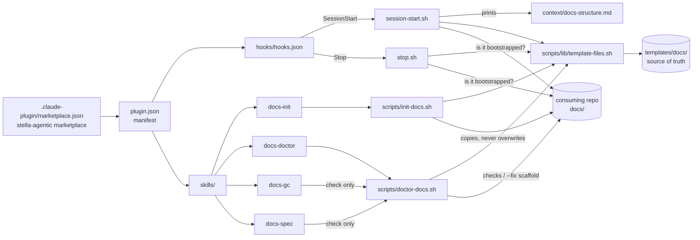
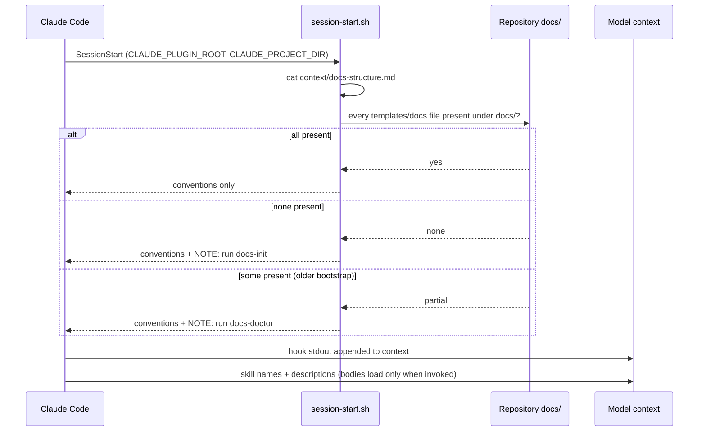
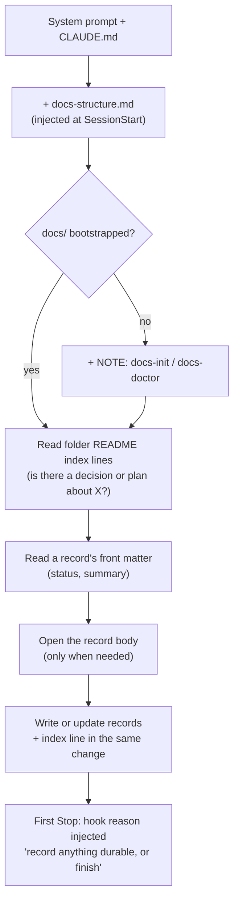
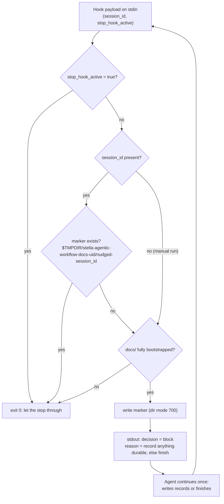
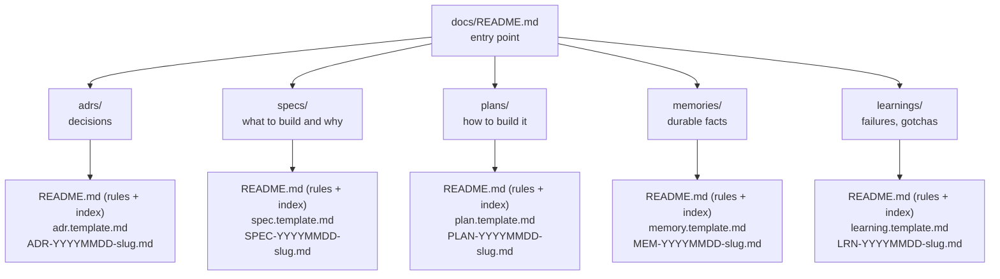
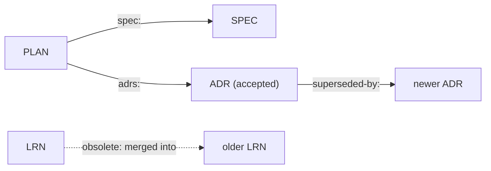
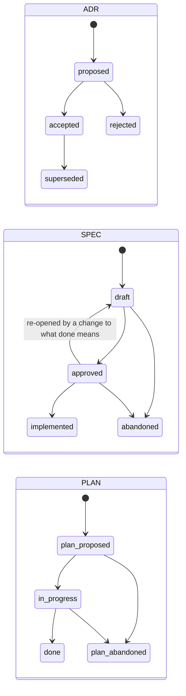
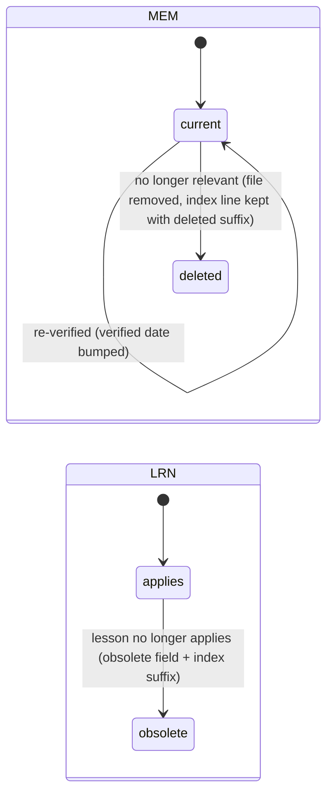
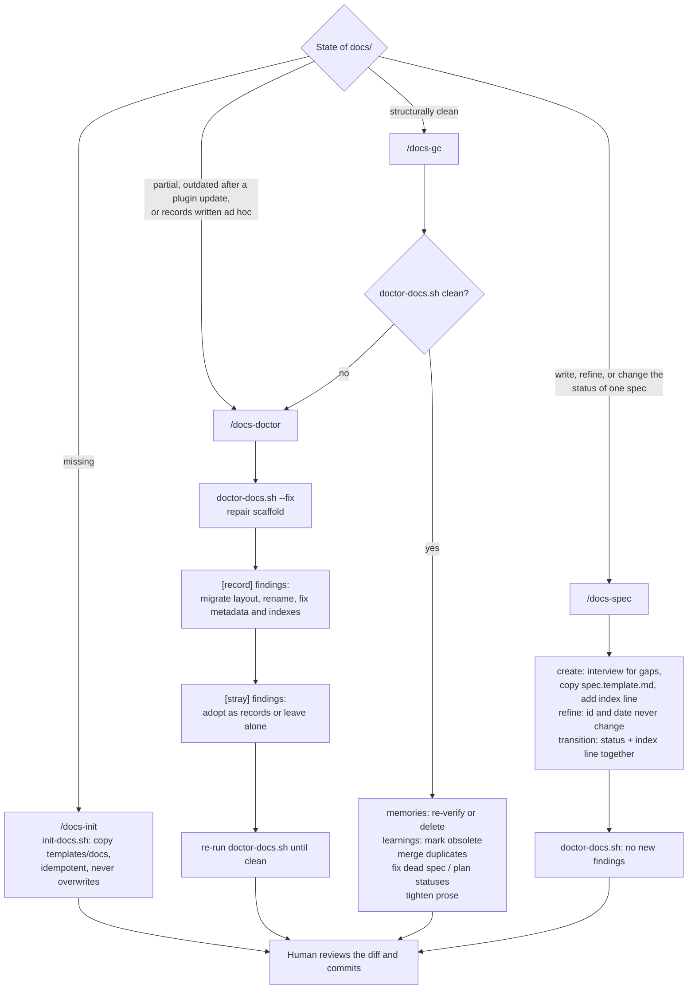

# stella-agentic-workflow-docs — visual map

A visual overview of the [`stella-agentic-workflow-docs`](plugins/stella-agentic-workflow-docs/README.md)
plugin: what it ships, how it changes what Claude sees in a session, and how the `docs/` tree
it maintains is organised. The plugin README and the folder `README.md`s remain the reference
for the exact rules; this file shows how the pieces fit together.

## 1. Inventory

Every kind of artifact a Claude Code plugin can ship, and what this one provides.

| Artifact type | Shipped | Path (under `plugins/stella-agentic-workflow-docs/`) |
| --- | --- | --- |
| Manifest | yes | `.claude-plugin/plugin.json` |
| Hooks | `SessionStart`, `Stop` | `hooks/hooks.json` → `hooks-handlers/session-start.sh`, `hooks-handlers/stop.sh` |
| Injected context | yes (≤ 200 words) | `context/docs-structure.md` |
| Skills | `docs-init`, `docs-doctor`, `docs-gc`, `docs-spec` | `skills/<name>/SKILL.md` |
| Scripts | `init-docs.sh`, `doctor-docs.sh`, shared `lib/template-files.sh` | `scripts/` |
| Scaffold (data) | the `docs/` tree with READMEs and templates | `templates/docs/` |
| Agents (subagents) | none | — |
| Slash commands | none (skills are invoked as `/stella-agentic-workflow-docs:<skill>`) | — |
| MCP servers | none | — |
| Output styles | none | — |

## 2. Component map

`templates/docs/` is the single source of truth: the bootstrapper copies it, both hooks check
against it, and the doctor derives its checks from it — all through one shared helper.

## 3. How a session learns the conventions

Claude Code runs the `SessionStart` hook for every session — CLI, desktop, or cloud. Whatever
the hook prints to stdout is added to the model's context, so the agent starts already knowing
the `docs/` layout. Skills appear to the model only as a name and description until invoked.

## 4. How the context changes during a session

The injected text is a thin pointer; detail is pulled in lazily, only as far as the task
needs. The `Stop` hook adds one more piece of guidance at the session's first stop.

## 5. How the Stop hook recognises a session

Claude Code fires `Stop` at the end of every assistant turn, and no hook can know which stop is
the last. The hook therefore nudges only the session's **first** stop, keyed on the
`session_id` in the hook payload, and never blocks the same stop twice.

## 6. How `docs/` is organised

Five typed folders. Each folder's `README.md` holds its conventions and its index; each ships
one `*.template.md` that every record starts from.

| Folder | Prefix | Front matter (besides `id`, `date`, `summary`) | Index line |
| --- | --- | --- | --- |
| `adrs/` | `ADR-` | `status`, `superseded-by`, `scope` | `- ADR-… — status — summary` |
| `specs/` | `SPEC-` | `status`, `type`, `source` | `- SPEC-… — status — summary` |
| `plans/` | `PLAN-` | `status`, `spec`, `adrs` | `- PLAN-… — status — summary` |
| `memories/` | `MEM-` | `type`, `verified` | `- MEM-… — type — summary` |
| `learnings/` | `LRN-` | `obsolete` | `- LRN-… — summary` |

Records are named `<PREFIX>-YYYYMMDD-slug.md` (creation date, slug of at most 4 words); the
whole stem is the id, and index lines stay at most 120 characters. Records reference each
other by id:

## 7. Record lifecycles

Statuses are kept in both the front matter and the index line. Nothing is ever renumbered or
erased: retired records keep their index line, so ids are never reused.

(`plan_proposed`, `in_progress`, `plan_abandoned` are the plan statuses `proposed`,
`in-progress`, `abandoned`; renamed only so the diagram keeps them distinct from ADR and spec
states.)

## 8. Which skill to run

Every skill leaves a diff for human review — none of them commits. `docs-spec` works on one
spec record at a time, on a bootstrapped tree, whenever a spec is written or changes status.

## Keeping this map current

This file must be updated in the same change as any change to the plugin's artifacts — see
the Conventions in [CLAUDE.md](CLAUDE.md). `scripts/checks.sh` fails when a skill, hook
handler, agent, or command exists in the plugin but is not mentioned here.
